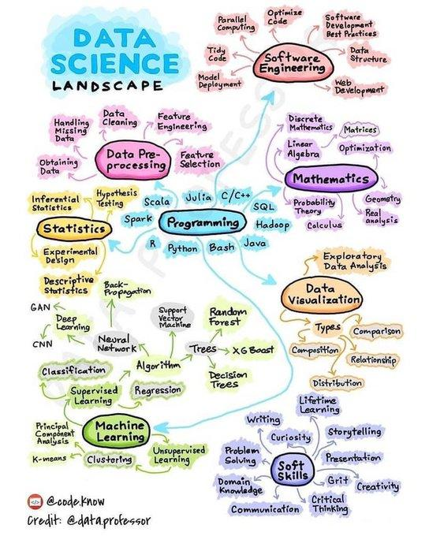

# Tools for a Data Science projects
This repository is a compendium of notebooks and scripts to be used in my daily work for Data Science projects. I will try to use this landscape as reference:

## Content
### [Tools](https://github.com/jmquintana79/utilsDS/blob/master/tools)
- [Data understanding](https://github.com/jmquintana79/utilsDS/blob/master/tools/data_understanding) *[0]*
- [Experiments mlflow](https://github.com/jmquintana79/utilsDS/blob/master/tools/experiments_mlflow) *[5]*
### [Scripts](https://github.com/jmquintana79/utilsDS/blob/master/scripts)
- [Analysis](https://github.com/jmquintana79/utilsDS/blob/master/scripts/analysis) *[0]*
  - [ADA](https://github.com/jmquintana79/utilsDS/blob/master/scripts/analysis/ADA) *[5]*
  - [Decision tree for analysis](https://github.com/jmquintana79/utilsDS/blob/master/scripts/analysis/decision_tree_for_analysis) *[3]*
    - [Dataset files](https://github.com/jmquintana79/utilsDS/blob/master/scripts/analysis/decision_tree_for_analysis/dataset_files) *[0]*
  - [Errors](https://github.com/jmquintana79/utilsDS/blob/master/scripts/analysis/errors) *[3]*
- [Plot](https://github.com/jmquintana79/utilsDS/blob/master/scripts/plot) *[4]*
- [Datasets](https://github.com/jmquintana79/utilsDS/blob/master/scripts/datasets) *[8]*
  - [Tools](https://github.com/jmquintana79/utilsDS/blob/master/scripts/datasets/tools) *[1]*
  - [Kaggle](https://github.com/jmquintana79/utilsDS/blob/master/scripts/datasets/kaggle) *[0]*
    - [Titanic](https://github.com/jmquintana79/utilsDS/blob/master/scripts/datasets/kaggle/titanic) *[1]*
  - [Summaries](https://github.com/jmquintana79/utilsDS/blob/master/scripts/datasets/summaries) *[0]*
  - [Data](https://github.com/jmquintana79/utilsDS/blob/master/scripts/datasets/data) *[0]*
- [Pipelines](https://github.com/jmquintana79/utilsDS/blob/master/scripts/pipelines) *[3]*
- [Utils](https://github.com/jmquintana79/utilsDS/blob/master/scripts/utils) *[6]*
- [Models](https://github.com/jmquintana79/utilsDS/blob/master/scripts/models) *[7]*
  - [Xgboost](https://github.com/jmquintana79/utilsDS/blob/master/scripts/models/xgboost) *[5]*
  - [GAM](https://github.com/jmquintana79/utilsDS/blob/master/scripts/models/gam) *[1]*
- [Dashboarding](https://github.com/jmquintana79/utilsDS/blob/master/scripts/dashboarding) *[1]*
- [Preprocessing](https://github.com/jmquintana79/utilsDS/blob/master/scripts/preprocessing) *[2]*
  - [Scalers](https://github.com/jmquintana79/utilsDS/blob/master/scripts/preprocessing/scalers) *[1]*
  - [Smoothers](https://github.com/jmquintana79/utilsDS/blob/master/scripts/preprocessing/smoothers) *[1]*
  - [Outliers](https://github.com/jmquintana79/utilsDS/blob/master/scripts/preprocessing/outliers) *[3]*
- [Data](https://github.com/jmquintana79/utilsDS/blob/master/scripts/data) *[2]*
### [Cheatsheets](https://github.com/jmquintana79/utilsDS/blob/master/cheatsheets)
- [Programming](https://github.com/jmquintana79/utilsDS/blob/master/cheatsheets/programming) *[0]*
### [Notebooks](https://github.com/jmquintana79/utilsDS/blob/master/notebooks)
- [Statistics](https://github.com/jmquintana79/utilsDS/blob/master/notebooks/statistics) *[0]*
  - [Probability](https://github.com/jmquintana79/utilsDS/blob/master/notebooks/statistics/probability) *[2]*
  - [Sampling](https://github.com/jmquintana79/utilsDS/blob/master/notebooks/statistics/sampling) *[4]*
    - [  pycache  ](https://github.com/jmquintana79/utilsDS/blob/master/notebooks/statistics/sampling/__pycache__) *[1]*
  - [Hypotesis testing](https://github.com/jmquintana79/utilsDS/blob/master/notebooks/statistics/hypotesis_testing) *[4]*
  - [Multimodal distribution analysis](https://github.com/jmquintana79/utilsDS/blob/master/notebooks/statistics/multimodal_distribution_analysis) *[1]*
  - [Impurity measurements](https://github.com/jmquintana79/utilsDS/blob/master/notebooks/statistics/impurity_measurements) *[2]*
    - [  pycache  ](https://github.com/jmquintana79/utilsDS/blob/master/notebooks/statistics/impurity_measurements/__pycache__) *[1]*
- [Analysis](https://github.com/jmquintana79/utilsDS/blob/master/notebooks/analysis) *[0]*
  - [EDA](https://github.com/jmquintana79/utilsDS/blob/master/notebooks/analysis/EDA) *[0]*
    - [Eda-tools](https://github.com/jmquintana79/utilsDS/blob/master/notebooks/analysis/EDA/EDA-tools) *[3]*
    - [Eda-autoeda libraries](https://github.com/jmquintana79/utilsDS/blob/master/notebooks/analysis/EDA/EDA-autoEDA_libraries) *[4]*
    - [Eda-describe](https://github.com/jmquintana79/utilsDS/blob/master/notebooks/analysis/EDA/EDA-describe) *[0]*
        - [  pycache  ](https://github.com/jmquintana79/utilsDS/blob/master/notebooks/analysis/EDA/EDA-describe/__pycache__) *[4]*
  - [Analysis missing values](https://github.com/jmquintana79/utilsDS/blob/master/notebooks/analysis/analysis_missing_values) *[1]*
  - [Analysis dpi](https://github.com/jmquintana79/utilsDS/blob/master/notebooks/analysis/analysis_dpi) *[1]*
  - [Factor analysis](https://github.com/jmquintana79/utilsDS/blob/master/notebooks/analysis/factor_analysis) *[2]*
  - [Analysis regression](https://github.com/jmquintana79/utilsDS/blob/master/notebooks/analysis/analysis_regression) *[2]*
  - [Analysis errors](https://github.com/jmquintana79/utilsDS/blob/master/notebooks/analysis/analysis_errors) *[1]*
  - [Analysis fourier](https://github.com/jmquintana79/utilsDS/blob/master/notebooks/analysis/analysis_fourier) *[2]*
  - [Analysis decision tree](https://github.com/jmquintana79/utilsDS/blob/master/notebooks/analysis/analysis_decision_tree) *[1]*
  - [Analysis non-linear correlation](https://github.com/jmquintana79/utilsDS/blob/master/notebooks/analysis/analysis_non-linear_correlation) *[1]*
  - [Analysis anomalies](https://github.com/jmquintana79/utilsDS/blob/master/notebooks/analysis/analysis_anomalies) *[4]*
  - [Plots](https://github.com/jmquintana79/utilsDS/blob/master/notebooks/analysis/plots) *[0]*
    - [Scatter plots](https://github.com/jmquintana79/utilsDS/blob/master/notebooks/analysis/plots/scatter_plots) *[1]*
    - [Hist kde](https://github.com/jmquintana79/utilsDS/blob/master/notebooks/analysis/plots/hist_KDE) *[1]*
    - [Pie chart](https://github.com/jmquintana79/utilsDS/blob/master/notebooks/analysis/plots/pie_chart) *[1]*
    - [Distribution](https://github.com/jmquintana79/utilsDS/blob/master/notebooks/analysis/plots/distribution) *[4]*
    - [Bar plots](https://github.com/jmquintana79/utilsDS/blob/master/notebooks/analysis/plots/bar_plots) *[1]*
- [Synthetic data](https://github.com/jmquintana79/utilsDS/blob/master/notebooks/synthetic_data) *[2]*
- [Pandas accelerators](https://github.com/jmquintana79/utilsDS/blob/master/notebooks/pandas_accelerators) *[1]*
- [Datasets](https://github.com/jmquintana79/utilsDS/blob/master/notebooks/datasets) *[5]*
- [Similarity](https://github.com/jmquintana79/utilsDS/blob/master/notebooks/similarity) *[1]*
- [Sampling](https://github.com/jmquintana79/utilsDS/blob/master/notebooks/sampling) *[3]*
- [Learning semi supervised](https://github.com/jmquintana79/utilsDS/blob/master/notebooks/learning_semi_supervised) *[1]*
- [Learning supervised](https://github.com/jmquintana79/utilsDS/blob/master/notebooks/learning_supervised) *[2]*
- [Automl](https://github.com/jmquintana79/utilsDS/blob/master/notebooks/automl) *[1]*
  - [Extended eda](https://github.com/jmquintana79/utilsDS/blob/master/notebooks/automl/Extended_EDA) *[0]*
  - [Automl 1](https://github.com/jmquintana79/utilsDS/blob/master/notebooks/automl/AutoML_1) *[0]*
    - [Ensemble](https://github.com/jmquintana79/utilsDS/blob/master/notebooks/automl/AutoML_1/Ensemble) *[0]*
    - [6 default randomforest](https://github.com/jmquintana79/utilsDS/blob/master/notebooks/automl/AutoML_1/6_Default_RandomForest) *[0]*
    - [EDA](https://github.com/jmquintana79/utilsDS/blob/master/notebooks/automl/AutoML_1/EDA) *[0]*
    - [2 decisiontree](https://github.com/jmquintana79/utilsDS/blob/master/notebooks/automl/AutoML_1/2_DecisionTree) *[0]*
    - [3 linear](https://github.com/jmquintana79/utilsDS/blob/master/notebooks/automl/AutoML_1/3_Linear) *[0]*
    - [1 baseline](https://github.com/jmquintana79/utilsDS/blob/master/notebooks/automl/AutoML_1/1_Baseline) *[0]*
    - [5 default neuralnetwork](https://github.com/jmquintana79/utilsDS/blob/master/notebooks/automl/AutoML_1/5_Default_NeuralNetwork) *[0]*
    - [4 default xgboost](https://github.com/jmquintana79/utilsDS/blob/master/notebooks/automl/AutoML_1/4_Default_Xgboost) *[0]*
- [Model interpretability](https://github.com/jmquintana79/utilsDS/blob/master/notebooks/model_interpretability) *[2]*
- [Workflow](https://github.com/jmquintana79/utilsDS/blob/master/notebooks/workflow) *[0]*
  - [Experiments](https://github.com/jmquintana79/utilsDS/blob/master/notebooks/workflow/experiments) *[1]*
    - [Experiments](https://github.com/jmquintana79/utilsDS/blob/master/notebooks/workflow/experiments/experiments) *[0]*
  - [Pipelines](https://github.com/jmquintana79/utilsDS/blob/master/notebooks/workflow/pipelines) *[2]*
- [NLP](https://github.com/jmquintana79/utilsDS/blob/master/notebooks/nlp) *[9]*
- [Feature engineering](https://github.com/jmquintana79/utilsDS/blob/master/notebooks/feature_engineering) *[0]*
  - [Missing values imputation](https://github.com/jmquintana79/utilsDS/blob/master/notebooks/feature_engineering/missing_values_imputation) *[1]*
  - [Features selection](https://github.com/jmquintana79/utilsDS/blob/master/notebooks/feature_engineering/features_selection) *[5]*
  - [Best practices for classification](https://github.com/jmquintana79/utilsDS/blob/master/notebooks/feature_engineering/best_practices_for_classification) *[1]*
- [Algorithms selection](https://github.com/jmquintana79/utilsDS/blob/master/notebooks/algorithms_selection) *[2]*
  - [Multiple algorithms evaluation with lazypredict](https://github.com/jmquintana79/utilsDS/blob/master/notebooks/algorithms_selection/multiple_algorithms_evaluation_with_lazypredict) *[2]*
> Updated on 2022-12-15 22:42:54
