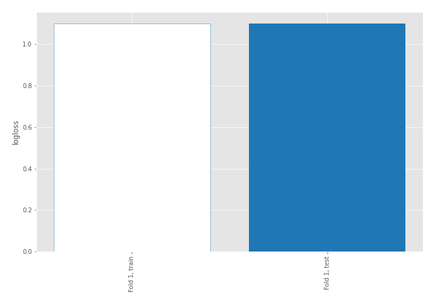

# Summary of 1_Baseline

[<< Go back](../README.md)

## Baseline Classifier (Baseline)
- **num_class**: 3
- **explain_level**: 2

## Validation
 - **validation_type**: split
 - **train_ratio**: 0.75
 - **shuffle**: True
 - **stratify**: True

## Optimized metric
logloss

## Training time

0.0 seconds

### Metric details
|           |   setosa |   versicolor |   virginica |   accuracy |   macro avg |   weighted avg |   logloss |
|:----------|---------:|-------------:|------------:|-----------:|------------:|---------------:|----------:|
| precision |        0 |     0.357143 |           0 |   0.357143 |    0.119048 |       0.127551 |   1.09862 |
| recall    |        0 |     1        |           0 |   0.357143 |    0.333333 |       0.357143 |   1.09862 |
| f1-score  |        0 |     0.526316 |           0 |   0.357143 |    0.175439 |       0.18797  |   1.09862 |
| support   |        9 |    10        |           9 |   0.357143 |   28        |      28        |   1.09862 |

## Confusion matrix
|                       |   Predicted as setosa |   Predicted as versicolor |   Predicted as virginica |
|:----------------------|----------------------:|--------------------------:|-------------------------:|
| Labeled as setosa     |                     0 |                         9 |                        0 |
| Labeled as versicolor |                     0 |                        10 |                        0 |
| Labeled as virginica  |                     0 |                         9 |                        0 |

## Learning curves

[<< Go back](../README.md)
