# Summary of 3_Linear

[<< Go back](../README.md)

## Logistic Regression (Linear)
- **num_class**: 3
- **explain_level**: 2

## Validation
 - **validation_type**: split
 - **train_ratio**: 0.75
 - **shuffle**: True
 - **stratify**: True

## Optimized metric
logloss

## Training time

4.5 seconds

### Metric details
|           |   setosa |   versicolor |   virginica |   accuracy |   macro avg |   weighted avg |   logloss |
|:----------|---------:|-------------:|------------:|-----------:|------------:|---------------:|----------:|
| precision |        1 |          0.9 |    0.888889 |   0.928571 |     0.92963 |       0.928571 |  0.273527 |
| recall    |        1 |          0.9 |    0.888889 |   0.928571 |     0.92963 |       0.928571 |  0.273527 |
| f1-score  |        1 |          0.9 |    0.888889 |   0.928571 |     0.92963 |       0.928571 |  0.273527 |
| support   |        9 |         10   |    9        |   0.928571 |    28       |      28        |  0.273527 |

## Confusion matrix
|                       |   Predicted as setosa |   Predicted as versicolor |   Predicted as virginica |
|:----------------------|----------------------:|--------------------------:|-------------------------:|
| Labeled as setosa     |                     9 |                         0 |                        0 |
| Labeled as versicolor |                     0 |                         9 |                        1 |
| Labeled as virginica  |                     0 |                         1 |                        8 |

## Learning curves
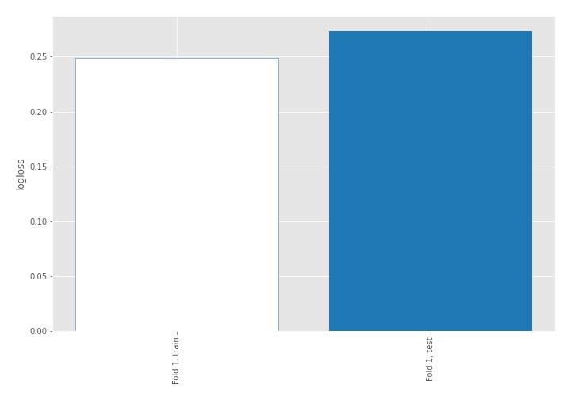

## Coefficients

### Coefficients learner #1
|                   |    setosa |   versicolor |   virginica |
|:------------------|----------:|-------------:|------------:|
| intercept         | -0.686118 |     1.30842  |   -0.622299 |
| sepal length (cm) | -1.22792  |     0.738491 |    0.489425 |
| sepal width (cm)  |  0.955292 |    -0.618426 |   -0.336866 |
| petal length (cm) | -2.06336  |    -0.796942 |    2.86031  |

## Permutation-based Importance
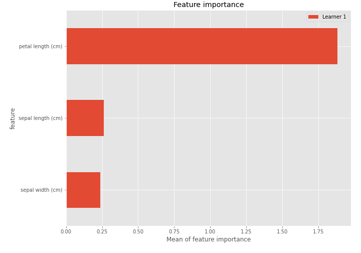

## SHAP Importance
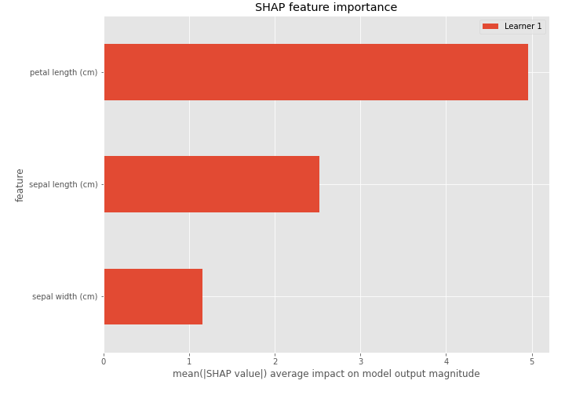

## SHAP Dependence plots

### Dependence setosa (Fold 1)
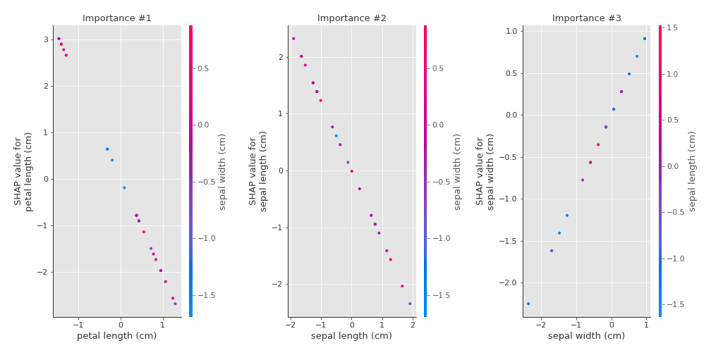
### Dependence versicolor (Fold 1)
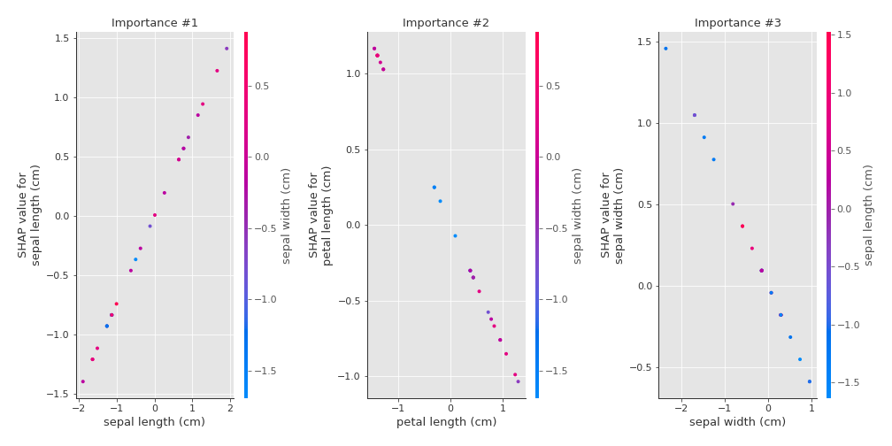
### Dependence virginica (Fold 1)
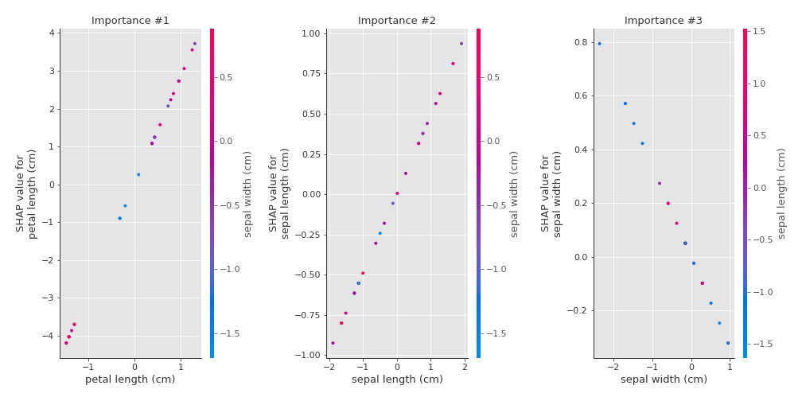

## SHAP Decision plots

### Worst decisions for selected sample 1 (Fold 1)
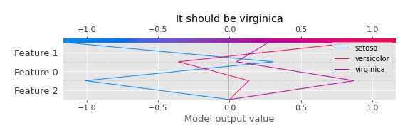
### Worst decisions for selected sample 2 (Fold 1)
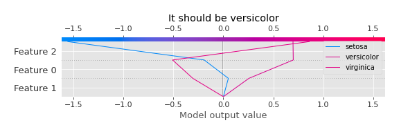
### Worst decisions for selected sample 3 (Fold 1)
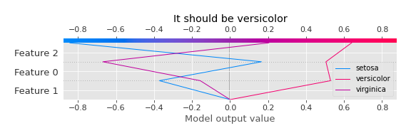
### Worst decisions for selected sample 4 (Fold 1)
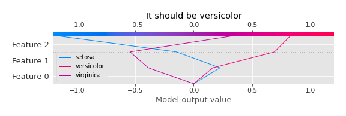
### Best decisions for selected sample 1 (Fold 1)
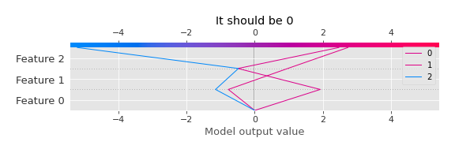
### Best decisions for selected sample 2 (Fold 1)
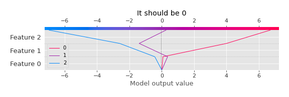
### Best decisions for selected sample 3 (Fold 1)
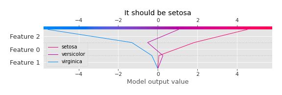
### Best decisions for selected sample 4 (Fold 1)
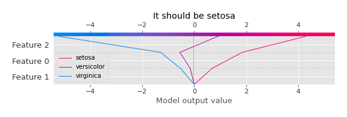

[<< Go back](../README.md)
