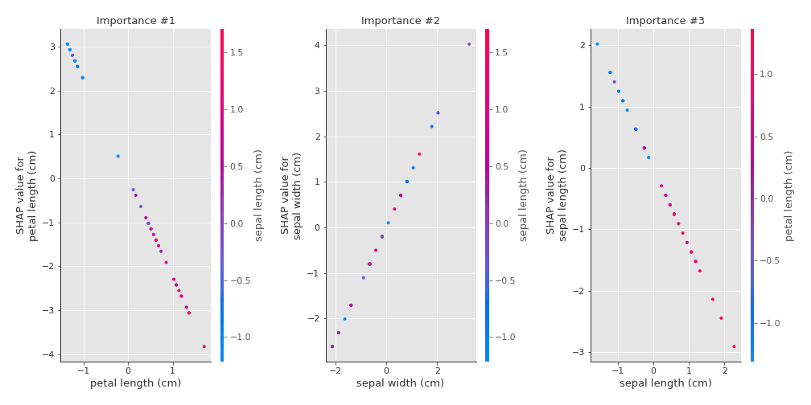
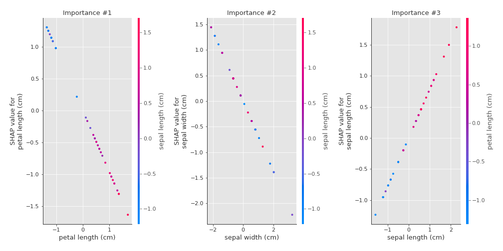
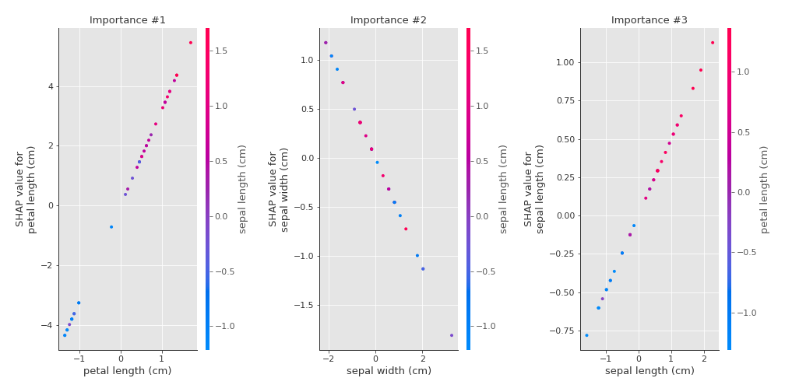

# Summary of 3_Linear

[<< Go back](../README.md)

## Logistic Regression (Linear)
- **num_class**: 3
- **explain_level**: 2

## Validation
 - **validation_type**: split
 - **train_ratio**: 0.75
 - **shuffle**: True
 - **stratify**: True

## Optimized metric
logloss

## Training time

4.7 seconds

### Metric details
|           |         0 |         1 |         2 |   accuracy |   macro avg |   weighted avg |   logloss |
|:----------|----------:|----------:|----------:|-----------:|------------:|---------------:|----------:|
| precision |  1        |  0.857143 |  0.923077 |   0.921053 |    0.92674  |       0.924812 |  0.243391 |
| recall    |  0.916667 |  0.923077 |  0.923077 |   0.921053 |    0.92094  |       0.921053 |  0.243391 |
| f1-score  |  0.956522 |  0.888889 |  0.923077 |   0.921053 |    0.922829 |       0.921943 |  0.243391 |
| support   | 12        | 13        | 13        |   0.921053 |   38        |      38        |  0.243391 |

## Confusion matrix
|              |   Predicted as 0 |   Predicted as 1 |   Predicted as 2 |
|:-------------|-----------------:|-----------------:|-----------------:|
| Labeled as 0 |               11 |                1 |                0 |
| Labeled as 1 |                0 |               12 |                1 |
| Labeled as 2 |                0 |                1 |               12 |

## Learning curves

## Coefficients

### Coefficients learner #1
|                   |         0 |         1 |         2 |
|:------------------|----------:|----------:|----------:|
| intercept         | -0.293546 |  1.39251  | -1.09896  |
| sepal length (cm) | -1.28144  |  0.7849   |  0.496538 |
| sepal width (cm)  |  1.23788  | -0.682515 | -0.555364 |
| petal length (cm) | -2.24628  | -0.957171 |  3.20345  |

## Permutation-based Importance

## SHAP Importance

## SHAP Dependence plots

### Dependence 0 (Fold 1)

### Dependence 1 (Fold 1)

### Dependence 2 (Fold 1)

## SHAP Decision plots

### Worst decisions for selected sample 1 (Fold 1)

### Worst decisions for selected sample 2 (Fold 1)

### Worst decisions for selected sample 3 (Fold 1)

### Worst decisions for selected sample 4 (Fold 1)

### Best decisions for selected sample 1 (Fold 1)

### Best decisions for selected sample 2 (Fold 1)

### Best decisions for selected sample 3 (Fold 1)

### Best decisions for selected sample 4 (Fold 1)

[<< Go back](../README.md)
