# Summary of 4_Default_Xgboost

[<< Go back](../README.md)

## Extreme Gradient Boosting (Xgboost)
- **objective**: multi:softprob
- **eval_metric**: mlogloss
- **eta**: 0.075
- **max_depth**: 6
- **min_child_weight**: 1
- **subsample**: 1.0
- **colsample_bytree**: 1.0
- **num_class**: 3
- **explain_level**: 2

## Validation
 - **validation_type**: split
 - **train_ratio**: 0.75
 - **shuffle**: True
 - **stratify**: True

## Optimized metric
logloss

## Training time

4.1 seconds

### Metric details
|           |   0 |         1 |         2 |   accuracy |   macro avg |   weighted avg |   logloss |
|:----------|----:|----------:|----------:|-----------:|------------:|---------------:|----------:|
| precision |   1 |  1        |  0.866667 |   0.947368 |    0.955556 |       0.954386 |  0.145484 |
| recall    |   1 |  0.846154 |  1        |   0.947368 |    0.948718 |       0.947368 |  0.145484 |
| f1-score  |   1 |  0.916667 |  0.928571 |   0.947368 |    0.948413 |       0.947055 |  0.145484 |
| support   |  12 | 13        | 13        |   0.947368 |   38        |      38        |  0.145484 |

## Confusion matrix
|              |   Predicted as 0 |   Predicted as 1 |   Predicted as 2 |
|:-------------|-----------------:|-----------------:|-----------------:|
| Labeled as 0 |               12 |                0 |                0 |
| Labeled as 1 |                0 |               11 |                2 |
| Labeled as 2 |                0 |                0 |               13 |

## Learning curves
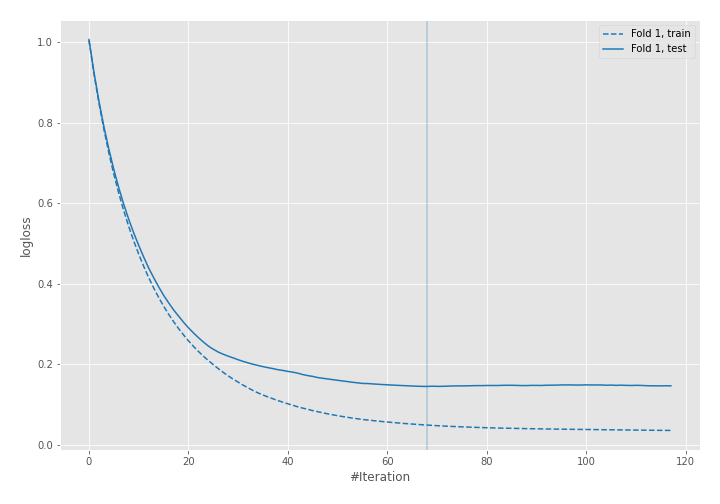

## Permutation-based Importance
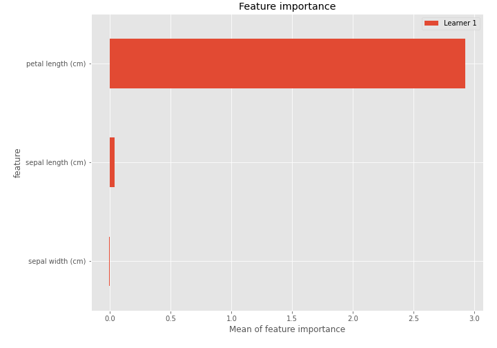

## SHAP Importance
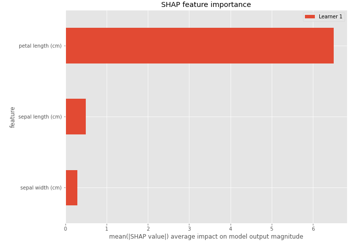

## SHAP Dependence plots

### Dependence 0 (Fold 1)
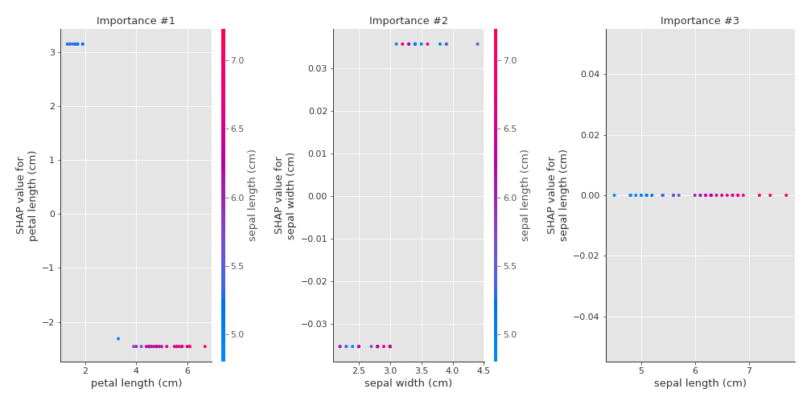
### Dependence 1 (Fold 1)
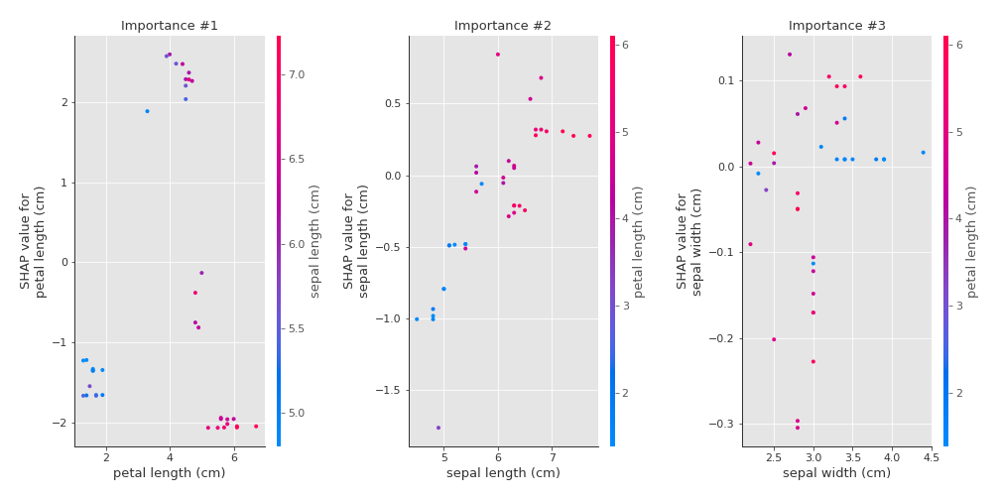
### Dependence 2 (Fold 1)

## SHAP Decision plots

### Worst decisions for selected sample 1 (Fold 1)
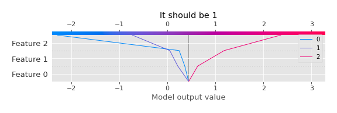
### Worst decisions for selected sample 2 (Fold 1)
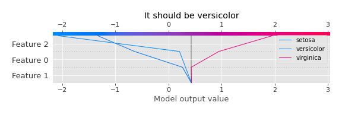
### Worst decisions for selected sample 3 (Fold 1)
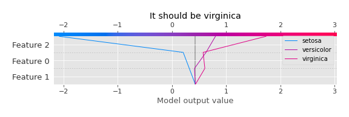
### Worst decisions for selected sample 4 (Fold 1)
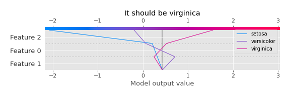
### Best decisions for selected sample 1 (Fold 1)

### Best decisions for selected sample 2 (Fold 1)
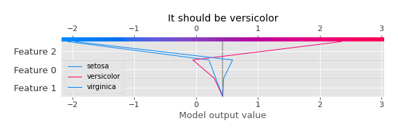
### Best decisions for selected sample 3 (Fold 1)
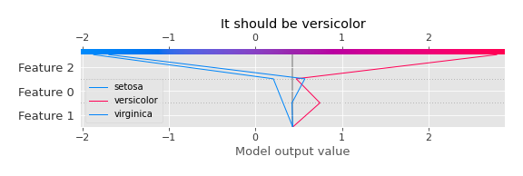
### Best decisions for selected sample 4 (Fold 1)

[<< Go back](../README.md)
