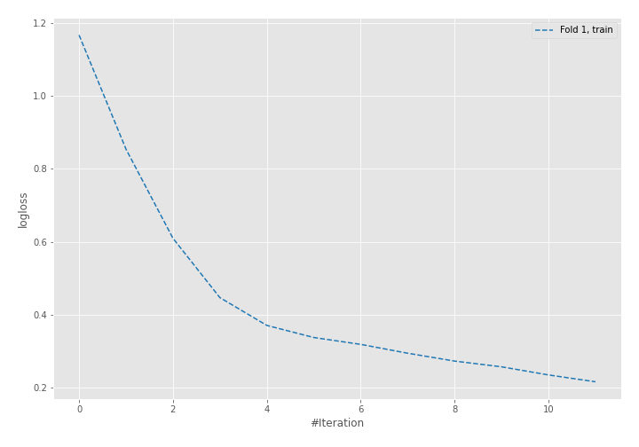
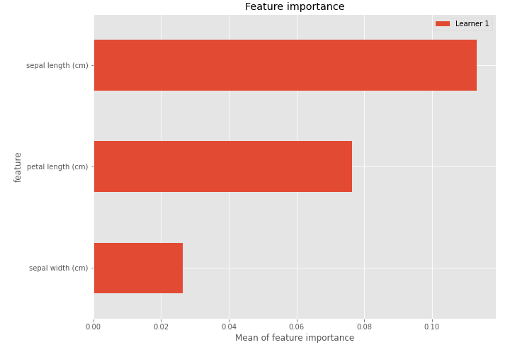

# Summary of 5_Default_NeuralNetwork

[<< Go back](../README.md)

## Neural Network
- **dense_1_size**: 32
- **dense_2_size**: 16
- **learning_rate**: 0.05
- **num_class**: 3
- **explain_level**: 2

## Validation
 - **validation_type**: split
 - **train_ratio**: 0.75
 - **shuffle**: True
 - **stratify**: True

## Optimized metric
logloss

## Training time

1.7 seconds

### Metric details
|           |         0 |         1 |         2 |   accuracy |   macro avg |   weighted avg |   logloss |
|:----------|----------:|----------:|----------:|-----------:|------------:|---------------:|----------:|
| precision |  1        |  0.909091 |  0.8125   |   0.894737 |    0.907197 |       0.904755 |   0.29232 |
| recall    |  0.916667 |  0.769231 |  1        |   0.894737 |    0.895299 |       0.894737 |   0.29232 |
| f1-score  |  0.956522 |  0.833333 |  0.896552 |   0.894737 |    0.895469 |       0.893862 |   0.29232 |
| support   | 12        | 13        | 13        |   0.894737 |   38        |      38        |   0.29232 |

## Confusion matrix
|              |   Predicted as 0 |   Predicted as 1 |   Predicted as 2 |
|:-------------|-----------------:|-----------------:|-----------------:|
| Labeled as 0 |               11 |                1 |                0 |
| Labeled as 1 |                0 |               10 |                3 |
| Labeled as 2 |                0 |                0 |               13 |

## Learning curves

## Permutation-based Importance

[<< Go back](../README.md)
