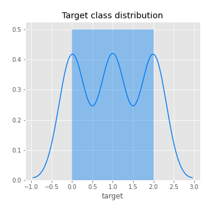

# Exploratory Data Analysis

[<< Go back](../README.md)
## Feature : target
- **Feature type** : categorical
- **Missing** : 0.0%
- **Unique** : 3
- **Count** :112
- **Unique** :3
- **Top** :versicolor
- **Freq** :39

## Feature : sepal length (cm)
- **Feature type** : continous
- **Missing** : 0.0%
- **Unique** : 34
- **Count** :112.0
- **Mean** :5.830357142857143
- **Std** :0.8191227218567639
- **Min** :4.3
- **25%th Percentile** : 5.1
- **50%th Percentile** : 5.8
- **75%th Percentile** : 6.4
- **Max** :7.7

.png)
## Feature : sepal width (cm)
- **Feature type** : continous
- **Missing** : 0.0%
- **Unique** : 22
- **Count** :112.0
- **Mean** :3.0401785714285716
- **Std** :0.4371199397177412
- **Min** :2.0
- **25%th Percentile** : 2.8
- **50%th Percentile** : 3.0
- **75%th Percentile** : 3.3
- **Max** :4.2

.png)
## Feature : petal length (cm)
- **Feature type** : continous
- **Missing** : 0.0%
- **Unique** : 39
- **Count** :112.0
- **Mean** :3.807142857142857
- **Std** :1.7353097335345846
- **Min** :1.1
- **25%th Percentile** : 1.6
- **50%th Percentile** : 4.3
- **75%th Percentile** : 5.1
- **Max** :6.7

.png)

[<< Go back](../README.md)
