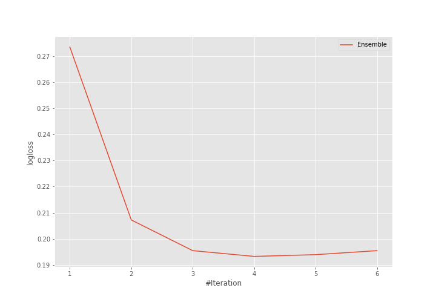

# Summary of Ensemble

[<< Go back](../README.md)

## Ensemble structure
| Model          |   Weight |
|:---------------|---------:|
| 2_DecisionTree |        3 |
| 3_Linear       |        1 |

### Metric details
|           |   setosa |   versicolor |   virginica |   accuracy |   macro avg |   weighted avg |   logloss |
|:----------|---------:|-------------:|------------:|-----------:|------------:|---------------:|----------:|
| precision |        1 |          0.9 |    0.888889 |   0.928571 |     0.92963 |       0.928571 |  0.193272 |
| recall    |        1 |          0.9 |    0.888889 |   0.928571 |     0.92963 |       0.928571 |  0.193272 |
| f1-score  |        1 |          0.9 |    0.888889 |   0.928571 |     0.92963 |       0.928571 |  0.193272 |
| support   |        9 |         10   |    9        |   0.928571 |    28       |      28        |  0.193272 |

## Confusion matrix
|                       |   Predicted as setosa |   Predicted as versicolor |   Predicted as virginica |
|:----------------------|----------------------:|--------------------------:|-------------------------:|
| Labeled as setosa     |                     9 |                         0 |                        0 |
| Labeled as versicolor |                     0 |                         9 |                        1 |
| Labeled as virginica  |                     0 |                         1 |                        8 |

## Learning curves

[<< Go back](../README.md)
