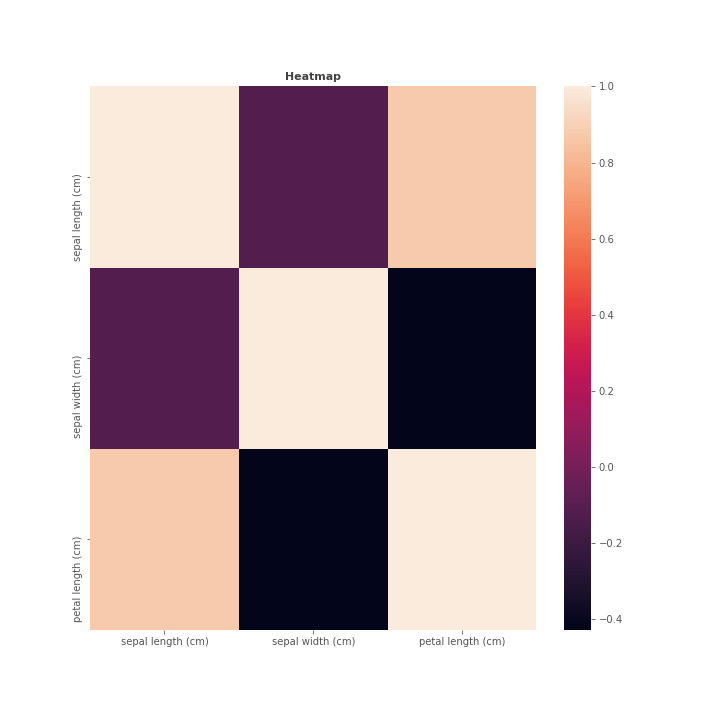

## Bivariate analysis of sepal length (cm) feature with target

_target.png)

------------------------------------------------------
## Bivariate analysis of sepal width (cm) feature with target

_target.png)

------------------------------------------------------
## Bivariate analysis of petal length (cm) feature with target

_target.png)

------------------------------------------------------
## Heatmap

------------------------------------------------------
